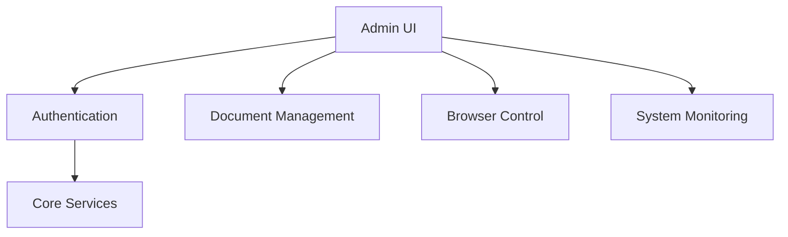
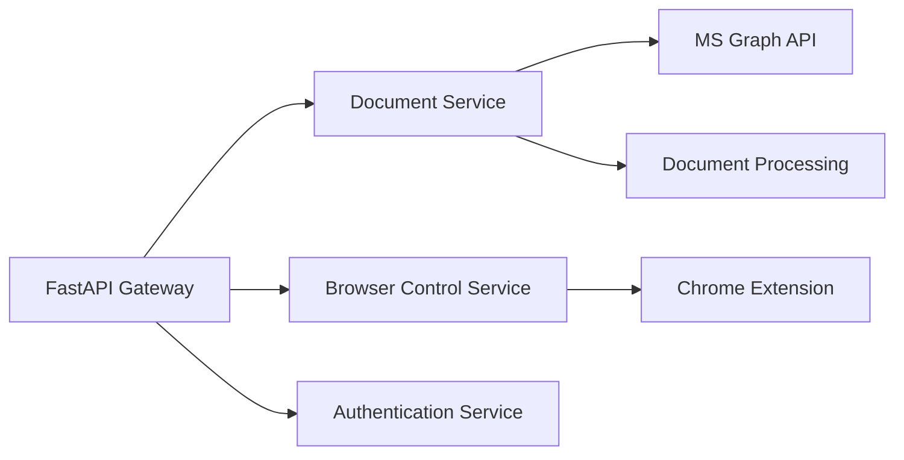
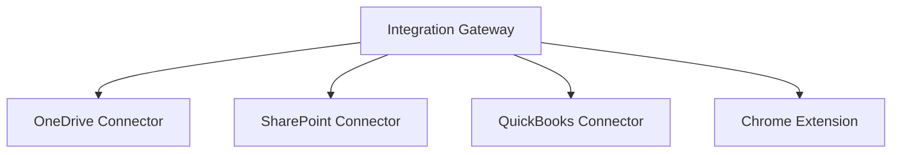
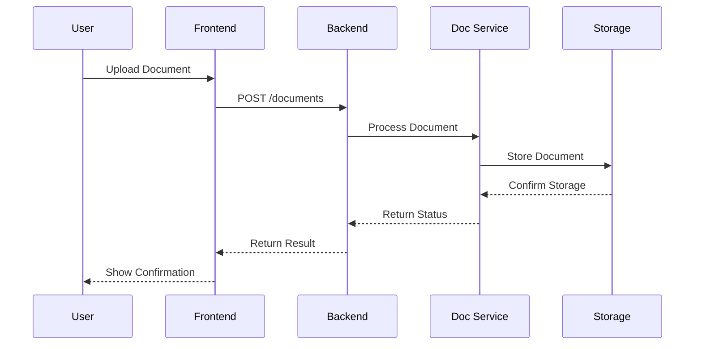
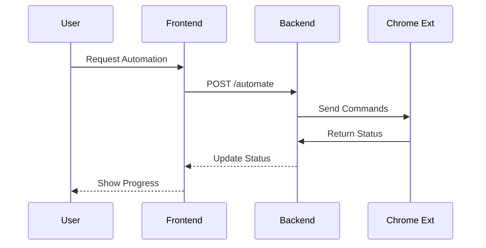

# Copyright (c) 2025 LALO AI SYSTEMS, LLC. All rights reserved.
#
# PROPRIETARY AND CONFIDENTIAL
#
# This file is part of LALO AI Platform and is protected by copyright law.
# Unauthorized copying, modification, distribution, or use of this software,
# via any medium, is strictly prohibited without the express written permission
# of LALO AI SYSTEMS, LLC.
#

# LALO AI System Architecture

## Core Components

### 1. Frontend Layer

### 2. Backend Services

### 3. Integration Layer

## API Specifications

### 1. Document Management API
- /api/v1/documents
  - GET /list
  - POST /upload
  - PUT /update
  - DELETE /remove
  - GET /search

### 2. Browser Control API
- /api/v1/browser
  - POST /navigate
  - POST /interact
  - GET /status
  - POST /automate

### 3. Authentication API
- /api/v1/auth
  - POST /login
  - POST /refresh
  - GET /verify
  - POST /logout

## Data Flow Patterns

### 1. Document Processing

### 2. Browser Automation

## Security Model

### 1. Authentication Flow
- Azure AD OAuth2
- JWT token management
- Role-based access control

### 2. Data Protection
- End-to-end encryption
- Secure storage
- Audit logging

## Integration Points

### 1. Microsoft Integration
- OneDrive API
- SharePoint API
- Office Document APIs

### 2. Financial Integration
- QuickBooks Online API

### 3. Browser Integration
- Chrome Extension API
- Browser Automation API

## Monitoring and Logging

### 1. System Monitoring
- Performance metrics
- Error tracking
- Usage statistics

### 2. Audit Logging
- User actions
- System events
- Security events
